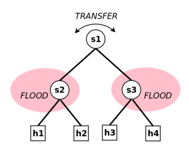

# Opendaylight

## Installation

Run using docker with `docker compose up -d` using the docker compose file in this folder.

## Connecting to the ODL Container

Connect to the Docker container `docker exec -it odl-openflow bin/client` where `odl-openflow` is the name of your container set in your docker compose file.

## Creating a network with Mininet

I will summarise and add to the worked example provided by P. David Arjona Villicaña in [Testing Software Defined
Networks with OpenDaylight and Mininet](./SDN_Book_Arjona2024.pdf).

- Connect your controller to a mininet isntance using a command like this: `sudo mn --controller=remote,ip=[controller.ip.address],port=6653 --topo tree,2 --switch ovsk,protocols=OpenFlow13`
- Connect to your ODL terminal: `docker exec -it odl-openflow bin/client` where `odl-openflow` is the name of your container set in your docker compose file.
- List your switches to ensure the network is connected to the controller `ofp:show-session-stats`. You should see something like the follwoing:

  ```
  SESSION : openflow:3
  CONNECTION_CREATED : 1
  SESSION : /10.10.10.118:35162
  CONNECTION_DISCONNECTED_BY_DEVICE : 1
  SESSION : openflow:2
  CONNECTION_CREATED : 2
  CONNECTION_DISCONNECTED_BY_OFP : 1
  SESSION : openflow:1
  CONNECTION_CREATED : 1
  ```

- If you run `pingall` from the mininet console you will see that 100% of the packets will be dropped as there are no flow entries to route this traffic on the switches. Follow Example 1 and 2 to get this network to work.

### Example 1

- We need to install flows to transfer packets between the ports in s1 and flood packets at switches s2 and s3. See the image below for a visualisation.



Run these commands from within the folder containing this README file.

1.  Set an environment variable for your ODL controller's IP address for the subsequent commands. Replace `10.10.10.2` with your actual controller IP if different:

    ```bash
    export IP_ADDRESS=10.10.10.2
    ```

2.  A flood entry for switch `s2` (openflow:2), port 1, can be installed using API calls as follows. This flow (ID 201) will flood packets received on port 1 of s2.

    ```bash
    curl -u admin:admin -X PUT \
    -d @sample-json-files/example1/flood_s2_p1.json \
    -H "Content-Type: application/json" \
    "http://${IP_ADDRESS}:8181/rests/data/opendaylight-inventory:nodes/node=openflow:2/flow-node-inventory:table=0/flow=201"
    ```

3.  The flow (ID 102) for transferring packets from port 2 to port 1 on switch `s1` (openflow:1) can be set up as follows:

    ```bash
    curl -u admin:admin -X PUT \
    -d @sample-json-files/example1/transfer_s1_p2_to_p1.json \
    -H "Content-Type: application/json" \
    "http://${IP_ADDRESS}:8181/rests/data/opendaylight-inventory:nodes/node=openflow:1/flow-node-inventory:table=0/flow=102"
    ```

4.  The flow (ID 101) for transferring packets from port 1 to port 2 on switch `s1` (openflow:1) can be set up as follows:

    ```bash
    curl -u admin:admin -X PUT \
    -d @sample-json-files/example1/transfer_s1_p1_to_p2.json \
    -H "Content-Type: application/json" \
    "http://${IP_ADDRESS}:8181/rests/data/opendaylight-inventory:nodes/node=openflow:1/flow-node-inventory:table=0/flow=101"
    ```

5.  Check these rules are installed:

    ```bash
    curl -v -u admin:admin GET "http://${IP_ADDRESS}:8181/rests/data/opendaylight-inventory:nodes/node=openflow:1/flow-node-inventory:table=0"
    ```

    The response should look similar to this:

    ```json
    {
      "flow-node-inventory:table": [
        {
          "id": 0,
          "flow": [
            {
              "id": "101",
              "table_id": 0,
              "priority": 4,
              "cookie_mask": "0",
              "idle-timeout": 0,
              "match": { "in-port": "openflow:1:1" },
              "cookie": "4",
              "instructions": {
                "instruction": [
                  {
                    "order": 0,
                    "apply-actions": {
                      "action": [
                        {
                          "order": 0,
                          "output-action": {
                            "max-length": 0,
                            "output-node-connector": "2"
                          }
                        }
                      ]
                    }
                  }
                ]
              },
              "hard-timeout": 0,
              "opendaylight-flow-statistics:flow-statistics": {
                "packet-count": "64",
                "byte-count": "5440",
                "duration": { "second": 265, "nanosecond": 710000000 }
              },
              "flags": ""
            },
            {
              "id": "#UF$TABLE*0-5",
              "table_id": 0,
              "priority": 0,
              "cookie_mask": "0",
              "idle-timeout": 0,
              "cookie": "10",
              "instructions": {
                "instruction": [
                  {
                    "order": 0,
                    "apply-actions": {
                      "action": [
                        {
                          "order": 0,
                          "output-action": {
                            "max-length": 65535,
                            "output-node-connector": "CONTROLLER"
                          }
                        }
                      ]
                    }
                  }
                ]
              },
              "hard-timeout": 0,
              "opendaylight-flow-statistics:flow-statistics": {
                "packet-count": "0",
                "byte-count": "0",
                "duration": { "second": 315, "nanosecond": 858000000 }
              },
              "flags": "SEND_FLOW_REM"
            },
            {
              "id": "102",
              "table_id": 0,
              "priority": 4,
              "cookie_mask": "0",
              "idle-timeout": 0,
              "match": { "in-port": "openflow:1:2" },
              "cookie": "4",
              "instructions": {
                "instruction": [
                  {
                    "order": 0,
                    "apply-actions": {
                      "action": [
                        {
                          "order": 0,
                          "output-action": {
                            "max-length": 0,
                            "output-node-connector": "1"
                          }
                        }
                      ]
                    }
                  }
                ]
              },
              "hard-timeout": 0,
              "opendaylight-flow-statistics:flow-statistics": {
                "packet-count": "64",
                "byte-count": "5440",
                "duration": { "second": 269, "nanosecond": 980000000 }
              },
              "flags": ""
            }
          ],
          "opendaylight-flow-table-statistics:flow-table-statistics": {
            "packets-looked-up": "128",
            "active-flows": 3,
            "packets-matched": "128"
          }
        }
      ]
    }
    ```

6.  For convinience the rest of the calls have been automated in the [configure_flows.sh](./configure_flows.sh) bash script. Run this using `./configure_flows.sh` and you should see the following output:
    ```bash
    $ ./configure_flows.sh
    Created flow-entries/transfer_s1_p1_to_p2.json
    Created flow-entries/transfer_s1_p2_to_p1.json
    Created flow-entries/flood_s2_p1.json
    Created flow-entries/flood_s2_p2.json
    Created flow-entries/flood_s2_p3.json
    Created flow-entries/flood_s3_p1.json
    Created flow-entries/flood_s3_p2.json
    Created flow-entries/flood_s3_p3.json
    Enter the OpenDaylight controllers IP address: 10.10.10.2
    Using controller IP: 10.10.10.2
    Uploading flows to switch s1...
    Uploading flows to switch s2...
    Uploading flows to switch s3...
    All flows have been uploaded. You can now try 'pingall' in Mininet.
    ```
7.  Run `pingall` in your mininet terminal and you should see the following:
    ```bash
    $ mininet> pingall
    *** Ping: testing ping reachability
    h1 -> h2 h3 h4
    h2 -> h1 h3 h4
    h3 -> h1 h2 h4
    h4 -> h1 h2 h3
    *** Results: 0% dropped (12/12 received)
    ```
